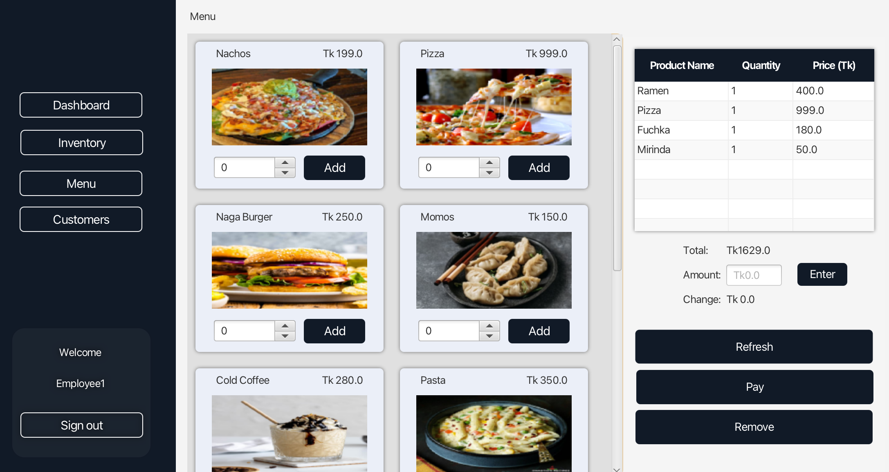

# Restaurant POS System

A Restaurant Management System built using Java, JavaFX for the front-end, JDBC for database connectivity, and MySQL as the database.

## Features

* **User Authentication:** Secure login for employees and managers.
* **Employee Dashboard:** An interface for restaurant staff to manage daily operations.
* **Product Management:** Functionality to add, view, and potentially update/delete products (menu items).
* **Point of Sale (POS):** Employee interface for processing customer orders and payments.
* **Cloud Customer Checkout:** A separate interface for customer-initiated orders or interactions.

## Screenshots

Here are some screenshots illustrating key parts of the system:

### Authentication Screen

This screenshot shows the user authentication interface where employees log in.

### Employee Dashboard

This is the main dashboard view for logged-in restaurant staff, providing access to various system functions.

### Add Products

This screenshot displays the interface used to add new products or menu items to the system's database.

### Employee Point of Sale (Checkout)

This shows the Point of Sale interface used by employees to take customer orders and process payments.

### Customer Cloud Checkout / Ordering

This screenshot illustrates the interface potentially used by customers for ordering or checkout in a cloud-based setup.

## Technologies Used

* **Backend Logic:** Pure Java
* **Frontend:** JavaFX
* **Database Connectivity:** JDBC
* **Database:** MySQL

## Setup

Will add later when possible. Hang tight!!